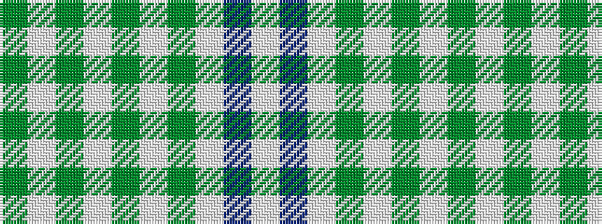

GWGWGWGWBW

It is a 10 stripe tartan.

<figure class="pat-woven">

<figcaption>idealised sample</figcaption>
</figure>

## Colour Sequence



## Tartans with this colour sequence

| Tartans |
|---------------|
| [Spirit of Pakistan, The](/setts/s10/g16w8dg2w1dg2w4dg24w8db16w4~x2/)|
||
