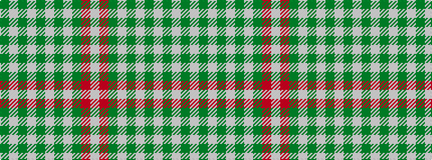

GWGWGWGWGRW

It is a 11 stripe tartan.

<figure class="pat-woven">

<figcaption>idealised sample</figcaption>
</figure>

## Colour Sequence



## Tartans with this colour sequence

| Tartans |
|---------------|
| [Prince George](/variants/s11/dg6w4dg3w4dg2w7dg2w2dg5r15w2~x2/)|
||
| [Prince George (Royal)](/variants/s11/g6w4g3w4g2w7g2w2g5r15w2~x2/)|
||
