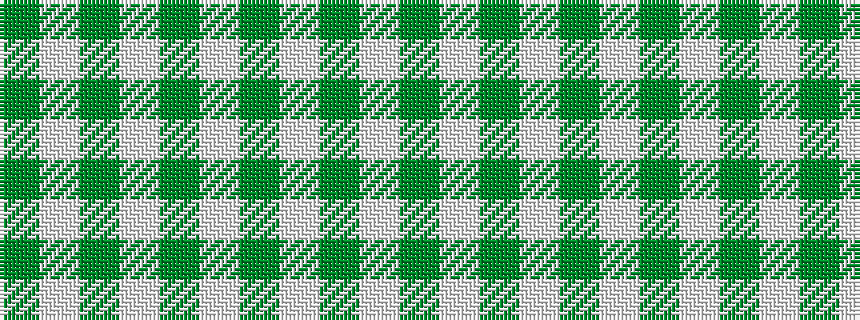

GWGWGWGWGW

It is a 10 stripe tartan.

<figure class="pat-woven">

<figcaption>idealised sample</figcaption>
</figure>

## Colour Sequence



## Tartans with this colour sequence

| Tartans |
|---------------|
| [Cowper (Personal)](/setts/s10/g1w1g8w1g8w1g2w1g4w1~x4/)|
||
