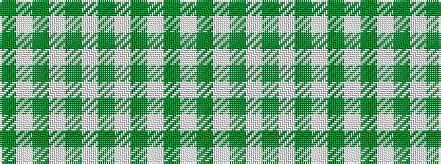

GWGWGWGWGWGWG

It is a 13 stripe tartan.

<figure class="pat-woven">

<figcaption>idealised sample</figcaption>
</figure>

## Colour Sequence



## Tartans with this colour sequence

| Tartans |
|---------------|
| [MacDonald, Lord of the Isles Hunting](/setts/s13/g24w1g2w2dg2w1dg12w1dg2w2dg2w1dg12~x2/)|
||
