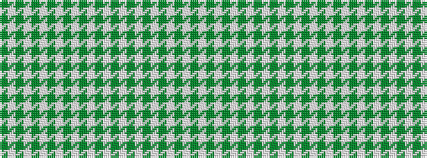

GWGWGWGWGWGWGWGWGWGWGWGWGW

It is a 26 stripe tartan.

<figure class="pat-woven">

<figcaption>idealised sample</figcaption>
</figure>

## Colour Sequence



## Tartans with this colour sequence

| Tartans |
|---------------|
| [Tulchan Estate Check (Corporate)](/variants/s26/g1w1dy1w1dy1w1dy1w1dy1w1dy1w1dy1w1~x4/)|
||
