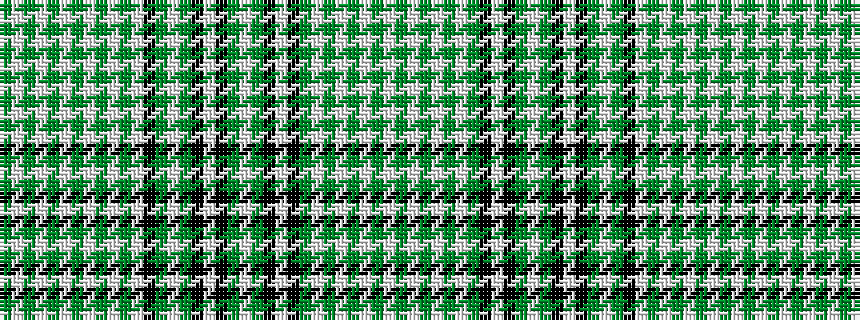

GWGWGWGWGWGWKGWGKWKGWGKWKGWGWGWGW

It is a 33 stripe tartan.

<figure class="pat-woven">

<figcaption>idealised sample</figcaption>
</figure>

## Colour Sequence



## Tartans with this colour sequence

| Tartans |
|---------------|
| [Miss Peffer's, Plaid](/setts/s33/y35w2y2w2y2w2y2w2y2w2y14w38k4y4w4y4k4w4k4y4w4y4k4w16k36y19w2y4w4y3w4y2w13~x2/)|
||
