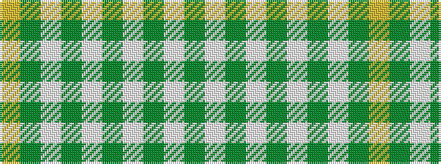

GWGWGWGWGY

It is a 10 stripe tartan.

<figure class="pat-woven">

<figcaption>idealised sample</figcaption>
</figure>

## Colour Sequence



## Tartans with this colour sequence

| Tartans |
|---------------|
| [St Patrick Trade or Fancy Tartan Tartan Number: 945. Earliest known date: 1977 An alternative source gives this sett as having been produced by Thomas Gordon of Glasgow around 1973. There is (c.1982) a pipe band in New York that wears this tartan. See products available Copyright © Blair Urquhart, Comrie, 2015](/setts/s10/g4w13g3w4g3w3g40w3g2ly4~x2/)|
||
| [St. Patrick (Fashion)](/setts/s10/dg4w13dg3w4dg3w3dg40w3dg2ly4~x2/)|
||
