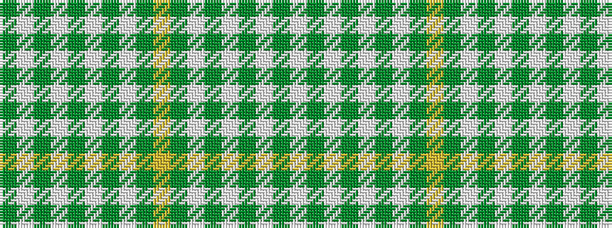

GWGWGWGWGYGWGWGWGW

It is a 18 stripe tartan.

<figure class="pat-woven">

<figcaption>idealised sample</figcaption>
</figure>

## Colour Sequence



## Tartans with this colour sequence

| Tartans |
|---------------|
| [St. Patrick](/setts/s18/w13dg3w4dg3w3dg40w3dg2ly4dg2w3dg40w3dg3w4dg3w13dg4~x2/)|
||
