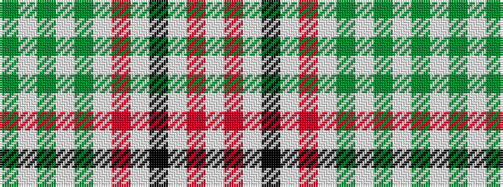

GWGWGWRWKWRW

It is a 12 stripe tartan.

<figure class="pat-woven">

<figcaption>idealised sample</figcaption>
</figure>

## Colour Sequence



## Tartans with this colour sequence

| Tartans |
|---------------|
| [Old England House Check](/variants/s12/w46o9w4k8w9r4w9dy2w2dy2w2dy1~x2/)|
||
