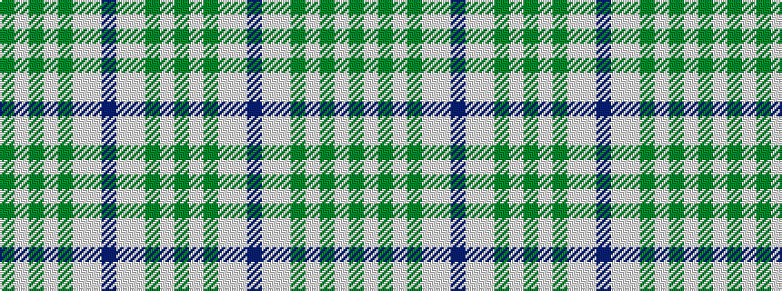

GWGWGWWBWWGWG

It is a 13 stripe tartan.

<figure class="pat-woven">

<figcaption>idealised sample</figcaption>
</figure>

## Colour Sequence



## Tartans with this colour sequence

| Tartans |
|---------------|
| [Poulter Millicent](/setts/s13/g69w14g13w14g13wi69w72dp13w72wi69g68w14g13/)|
||
| [Poulter Millicent](/setts/s13/g36w7g7w7g7lb36w35dp7w36lb35g34w7g7/)|
||
