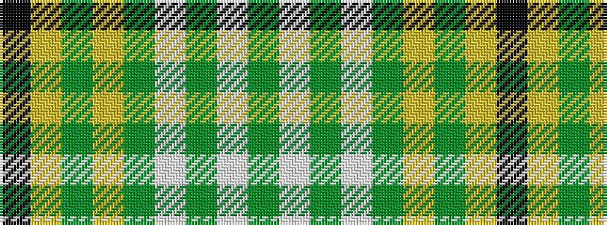

GWGWGYGYK

It is a 9 stripe tartan.

<figure class="pat-woven">

<figcaption>idealised sample</figcaption>
</figure>

## Colour Sequence



## Tartans with this colour sequence

| Tartans |
|---------------|
| [Crumlish (2015)](/variants/s9/k44ly2dg27ly2dgi16w8dg16w2dg8~x2/)|
||
