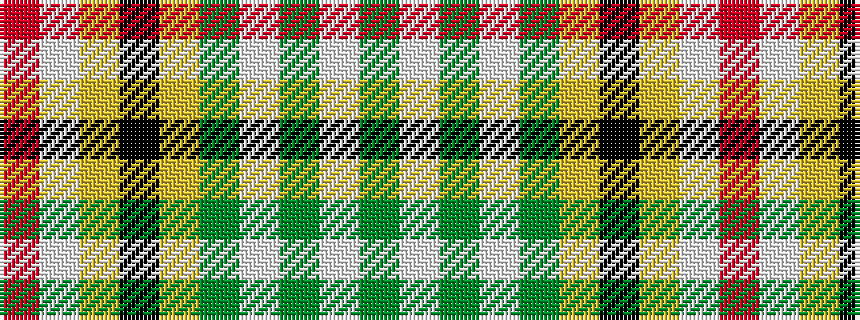

GWGWGYKYWR

It is a 10 stripe tartan.

<figure class="pat-woven">

<figcaption>idealised sample</figcaption>
</figure>

## Colour Sequence



## Tartans with this colour sequence

| Tartans |
|---------------|
| [Glendale](/setts/s10/dy5w1dy5w1g6ly1k1ly1lb8r1~x4/)|
||
