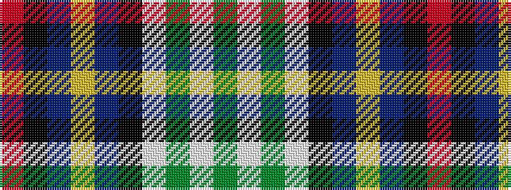

GWGWKBYBKR

It is a 10 stripe tartan.

<figure class="pat-woven">

<figcaption>idealised sample</figcaption>
</figure>

## Colour Sequence



## Tartans with this colour sequence

| Tartans |
|---------------|
| [Gillies Dress Blue #1 (Dance)](/variants/s10/r7k2t16ly5t10k13w28dg2w4dg4~x2/)|
||
| [Gillies, Blue dress](/variants/s10/r7k2t16ly5t10k13w28g2w4g2~x2/)|
||
