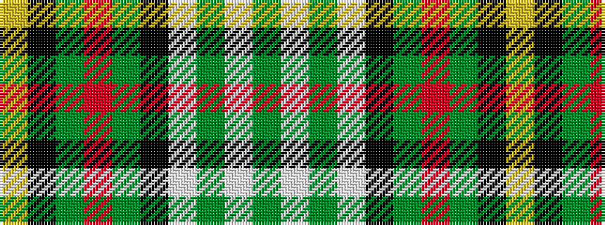

GWGWKGRGKY

It is a 10 stripe tartan.

<figure class="pat-woven">

<figcaption>idealised sample</figcaption>
</figure>

## Colour Sequence



## Tartans with this colour sequence

| Tartans |
|---------------|
| [Gillies Dress Green](/setts/s10/lo12k3g24r12g24k32w44g4w8g4/)|
||
