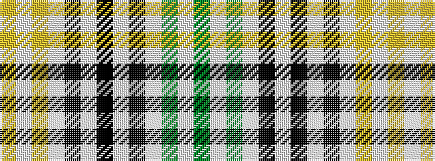

GWGWKWKWKWYWY

It is a 13 stripe tartan.

<figure class="pat-woven">

<figcaption>idealised sample</figcaption>
</figure>

## Colour Sequence



## Tartans with this colour sequence

| Tartans |
|---------------|
| [Glen Flesk](/setts/s13/dg1lb1dg1lb2k2lb2k2lb2k2lb2lo1lb1lo1~x4/)|
||
