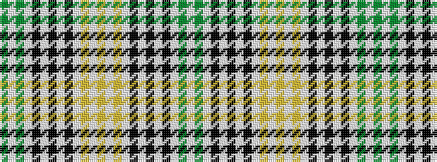

GWGWKWKWKWYWYWYWKWKWKWGW

It is a 24 stripe tartan.

<figure class="pat-woven">

<figcaption>idealised sample</figcaption>
</figure>

## Colour Sequence



## Tartans with this colour sequence

| Tartans |
|---------------|
| [Glen Flesk Fashion Restricted Tartan Tartan Number: 2369. Earliest known date: 1997 Designed in May 1997 by Lochcarron for The Check Trading Co, Tokyo, Japan. Based on the Burns Check. Sample in STA's Johnston Collection. See products available Copyright © Blair Urquhart, Comrie, 2015](/setts/s24/dg1lb1dg1lb2k2lb2k2lb2k2lb2lo1lb1lo1~x4/)|
||
