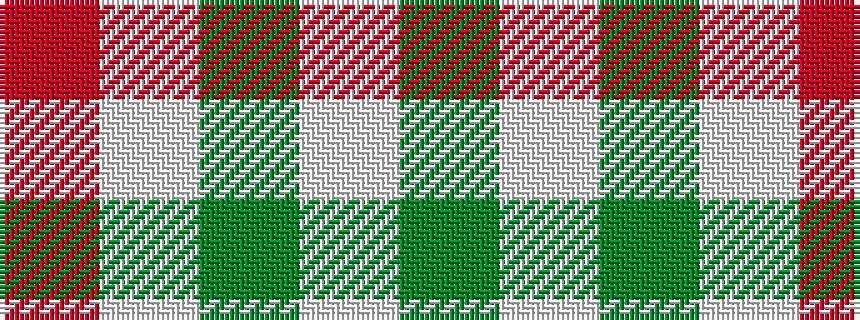

GWGWR

It is a 5 stripe tartan.

<figure class="pat-woven">

<figcaption>idealised sample</figcaption>
</figure>

## Colour Sequence



## Tartans with this colour sequence

| Tartans |
|---------------|
| [Trinity Bicycles (Corporate)](/setts/s5/r4lbi30y14lb11y4~x2/)|
||
