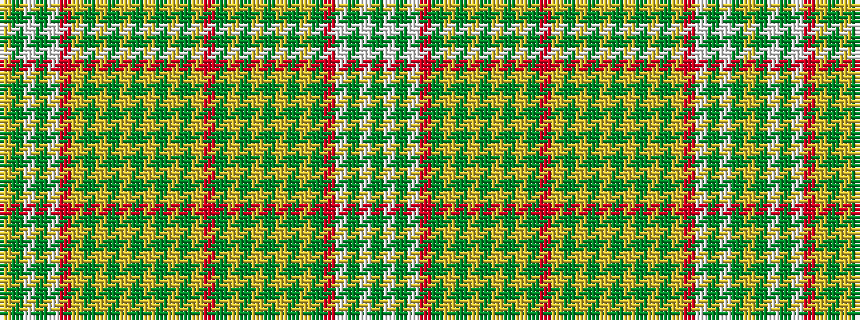

GWGWRGYGYGYGYGRYGYGYGYGYGYRWGWGY

It is a 32 stripe tartan.

<figure class="pat-woven">

<figcaption>idealised sample</figcaption>
</figure>

## Colour Sequence



## Tartans with this colour sequence

| Tartans |
|---------------|
| [Strathearn Dress (Fashion?)](/variants/s32/dy2w10dy4w4r7dg10lo4dg2lo2dg5lo2dg2lo4dg10r7lo2dy7lo5dy2lo2dy5lo2dy2lo4dy7lo2r7w4dy4w10dy2lo2~x2/)|
||
