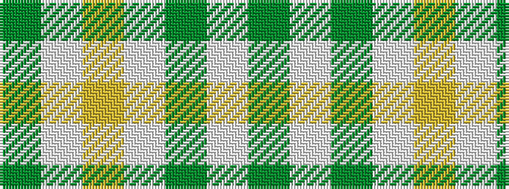

GWGWYWG

It is a 7 stripe tartan.

<figure class="pat-woven">

<figcaption>idealised sample</figcaption>
</figure>

## Colour Sequence



## Tartans with this colour sequence

| Tartans |
|---------------|
| [Heritage #2](/variants/s7/dg20w2dg9w2ly5w7dg10~x2/)|
||
| [Heritage (Commemorative)](/variants/s7/g20w2g9w2ly5w7g10~x2/)|
||
