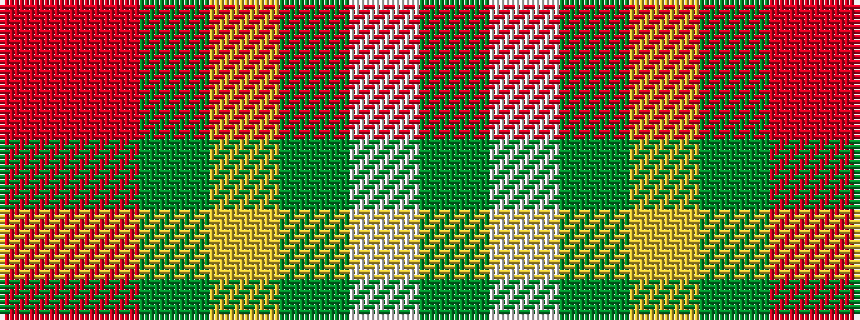

GWGYGRR

It is a 7 stripe tartan.

<figure class="pat-woven">

<figcaption>idealised sample</figcaption>
</figure>

## Colour Sequence



## Tartans with this colour sequence

| Tartans |
|---------------|
| [Weathered Cyclist](/setts/s7/y32w2y9ly2y12o21r1~x2/)|
||
