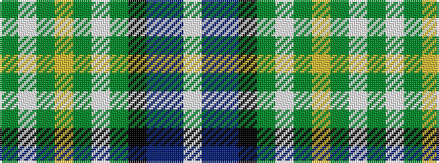

GWGYGWGKBBW

It is a 11 stripe tartan.

<figure class="pat-woven">

<figcaption>idealised sample</figcaption>
</figure>

## Colour Sequence



## Tartans with this colour sequence

| Tartans |
|---------------|
| [MacKellar](/setts/s11/g32w2g2ly3g2w2g2k16t2db16w3~x2/)|
||
