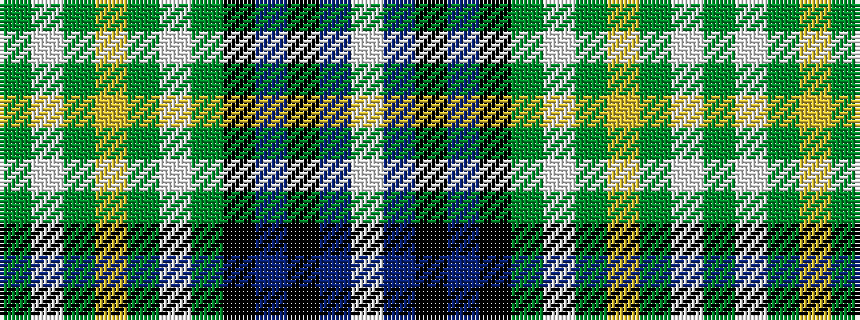

GWGYGWGKBKBW

It is a 12 stripe tartan.

<figure class="pat-woven">

<figcaption>idealised sample</figcaption>
</figure>

## Colour Sequence



## Tartans with this colour sequence

| Tartans |
|---------------|
| [MacKellar](/variants/s12/g30w3g4ly5g4w3g6k14t3k14db18w4~x2/)|
||
