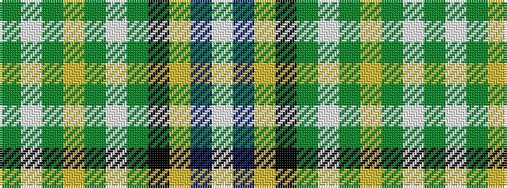

GWGYGWGKYBW

It is a 11 stripe tartan.

<figure class="pat-woven">

<figcaption>idealised sample</figcaption>
</figure>

## Colour Sequence



## Tartans with this colour sequence

| Tartans |
|---------------|
| [Wcwm 1290](/variants/s11/dg28lb2dg3lo4dg3lb2dg3k14lg2db28lb3~x2/)|
||
