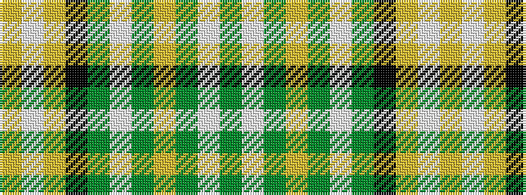

GWGYGWGKYWY

It is a 11 stripe tartan.

<figure class="pat-woven">

<figcaption>idealised sample</figcaption>
</figure>

## Colour Sequence



## Tartans with this colour sequence

| Tartans |
|---------------|
| [MacKellar Dress, Green (Dance)](/setts/s11/dg27w2dg3lo4dg3w2dg5k13lg2w26lg3~x2/)|
||
