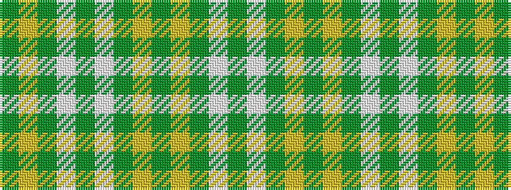

GWGYGYGWGWGYG

It is a 13 stripe tartan.

<figure class="pat-woven">

<figcaption>idealised sample</figcaption>
</figure>

## Colour Sequence



## Tartans with this colour sequence

| Tartans |
|---------------|
| [McGill (Personal)](/setts/s13/g2w10g3lo4g3lo4g24w2g4w4g1lo4g1~x2/)|
||
