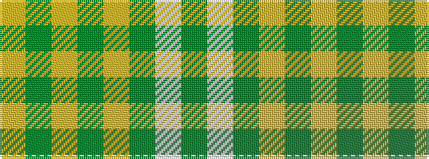

GWGYGYGY

It is a 8 stripe tartan.

<figure class="pat-woven">

<figcaption>idealised sample</figcaption>
</figure>

## Colour Sequence



## Tartans with this colour sequence

| Tartans |
|---------------|
| [Baillie Dress](/setts/s8/lo24dy3lo3dy3lo3dy20w22dy4~x2/)|
||
