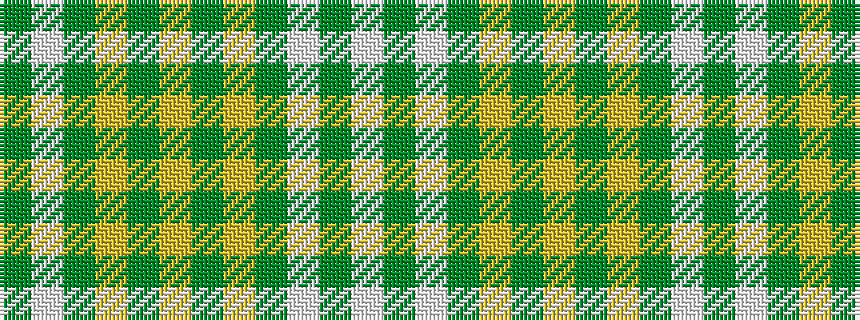

GWGYGYGYGWGW

It is a 12 stripe tartan.

<figure class="pat-woven">

<figcaption>idealised sample</figcaption>
</figure>

## Colour Sequence



## Tartans with this colour sequence

| Tartans |
|---------------|
| [Australian Spirit](/setts/s12/dg4w2dg24ly8dg2ly4dg2ly16dg8w2dg1w4~x2/)|
||
