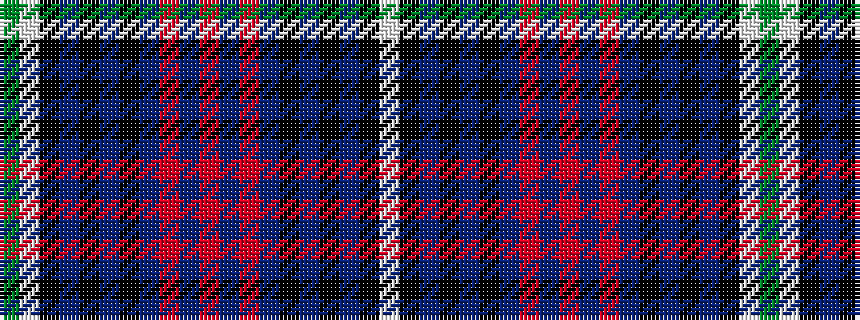

GWKBKBKBRBRBRBKBKBKW

It is a 20 stripe tartan.

<figure class="pat-woven">

<figcaption>idealised sample</figcaption>
</figure>

## Colour Sequence



## Tartans with this colour sequence

| Tartans |
|---------------|
| [Sutherland, Dress Royal (Dance)](/setts/s20/w24k12db3k2db2k2db12r1db1r3db1r1db12k2db2k2db3k12w24g2~x4/)|
||
