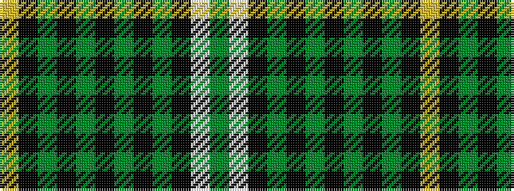

GWKGKGKGKGKY

It is a 12 stripe tartan.

<figure class="pat-woven">

<figcaption>idealised sample</figcaption>
</figure>

## Colour Sequence



## Tartans with this colour sequence

| Tartans |
|---------------|
| [Handley (Personal)](/variants/s12/dg12w2k5g24k4dg9k2g13k4dg13k2ly3~x2/)|
||
