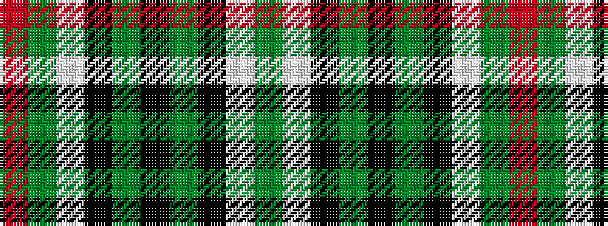

GWKGKGKWGR

It is a 10 stripe tartan.

<figure class="pat-woven">

<figcaption>idealised sample</figcaption>
</figure>

## Colour Sequence



## Tartans with this colour sequence

| Tartans |
|---------------|
| [Sir Billi](/setts/s10/dg12w5k11dg42k3dg42k11w5dg12r8~x2/)|
||
