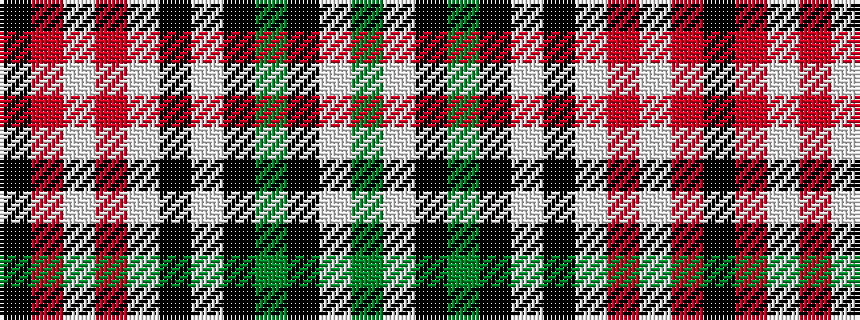

GWKGKWKWRWRK

It is a 12 stripe tartan.

<figure class="pat-woven">

<figcaption>idealised sample</figcaption>
</figure>

## Colour Sequence



## Tartans with this colour sequence

| Tartans |
|---------------|
| [MacLean of Duart Dress #2](/variants/s12/y12w2k4g2k3w3k3w19r30w2r4k2~x2/)|
||
