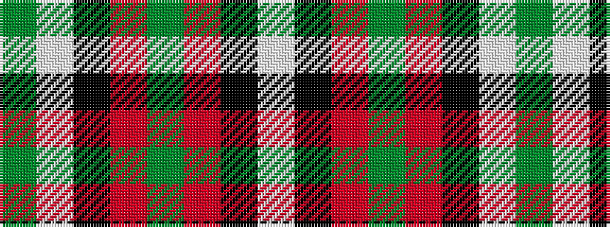

GWKRGRKW

It is a 8 stripe tartan.

<figure class="pat-woven">

<figcaption>idealised sample</figcaption>
</figure>

## Colour Sequence



## Tartans with this colour sequence

| Tartans |
|---------------|
| [New York Jets](/variants/s8/dg60w3k12o5dg9o6k4w10/)|
||
