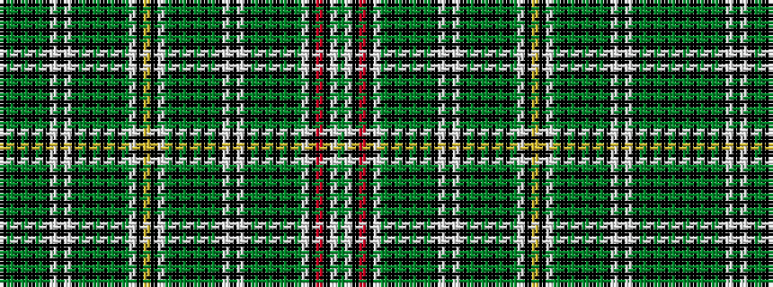

GWKRKWGKGKGKGKWKWKGKGKGKGWKYKWGKGKGKGKWKWKGKGKGK

It is a 48 stripe tartan.

<figure class="pat-woven">

<figcaption>idealised sample</figcaption>
</figure>

## Colour Sequence



## Tartans with this colour sequence

| Tartans |
|---------------|
| [Recovery dress](/setts/s48/k1g1k1g1k1g1k8w1k2w1k8g1k1g1k1g1k1g1w8k1ly1k1w8g1k1g1k1g1k1g1k8w1k2w1k8g1k1g1k1g1k1g1w8k1r1k1w8g1~x4/)|
||
