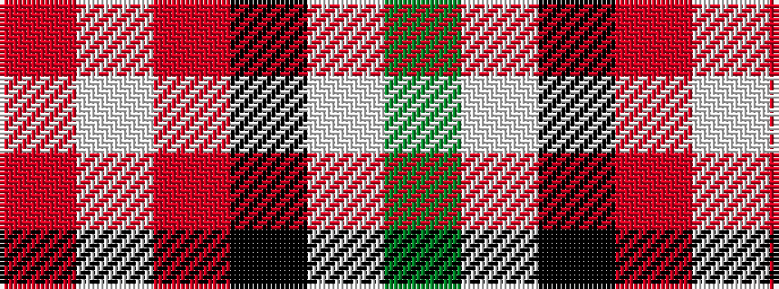

GWKRWR

It is a 6 stripe tartan.

<figure class="pat-woven">

<figcaption>idealised sample</figcaption>
</figure>

## Colour Sequence



## Tartans with this colour sequence

| Tartans |
|---------------|
| [Nesbit, Rose](/setts/s6/r6lb3r37k16lb16g4~x2/)|
||
| [Nisbet Dress Rose (Dance)](/setts/s6/m3w1m20k8w8g2~x4/)|
||
