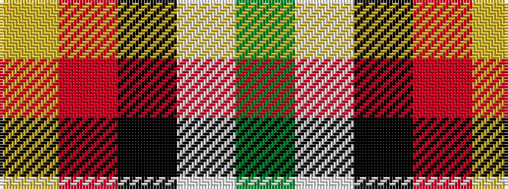

GWKRY

It is a 5 stripe tartan.

<figure class="pat-woven">

<figcaption>idealised sample</figcaption>
</figure>

## Colour Sequence



## Tartans with this colour sequence

| Tartans |
|---------------|
| [Benedict (Personal)](/setts/s5/dg4lb4k2r15ly4~x4/)|
||
| [Benedict (Personal)](/setts/s5/g4lb4k2r15ly4~x4/)|
||
