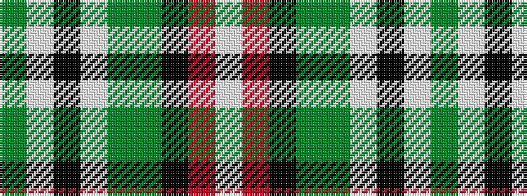

GWKWGGKRW

It is a 9 stripe tartan.

<figure class="pat-woven">

<figcaption>idealised sample</figcaption>
</figure>

## Colour Sequence



## Tartans with this colour sequence

| Tartans |
|---------------|
| [Leach, Leech, Leitch, hunting](/setts/s9/dg32w1k3w1g14dg7k3m3w1~x2/)|
||
