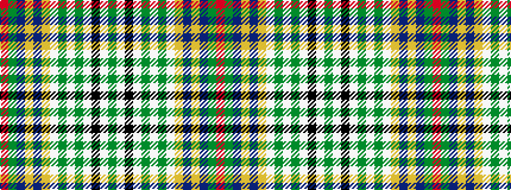

GWKWGWGWYBYBGR

It is a 14 stripe tartan.

<figure class="pat-woven">

<figcaption>idealised sample</figcaption>
</figure>

## Colour Sequence



## Tartans with this colour sequence

| Tartans |
|---------------|
| [Harrods (Corporate)](/variants/s14/dy2w2k2w12dy1w1dy1w1lo4do5lo2do9dy3r2~x2/)|
||
