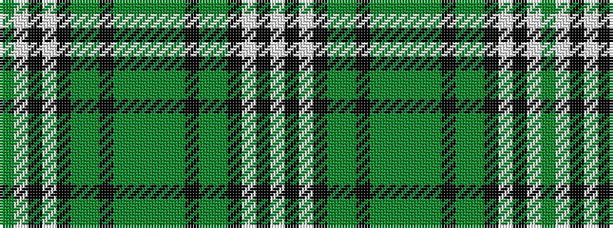

GWKWKGGKGGGGGKGGKWKW

It is a 20 stripe tartan.

<figure class="pat-woven">

<figcaption>idealised sample</figcaption>
</figure>

## Colour Sequence



## Tartans with this colour sequence

| Tartans |
|---------------|
| [Undiscovered Scotland](/variants/s20/lb3k18lb5k5gi6g1k6dg3gi6dg50gi6dg3k6g1gi6k5lb5k18lb3g1~x2/)|
||
