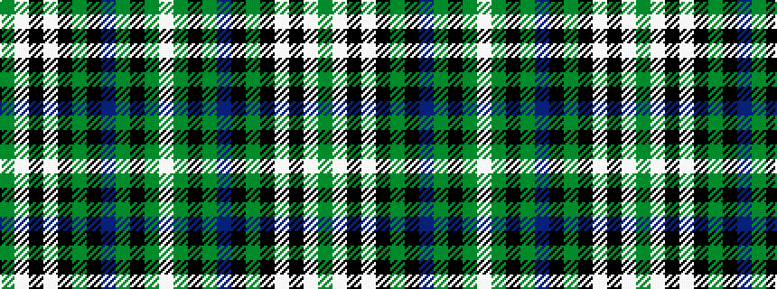

GWKWKGKBGKGW

It is a 12 stripe tartan.

<figure class="pat-woven">

<figcaption>idealised sample</figcaption>
</figure>

## Colour Sequence



## Tartans with this colour sequence

| Tartans |
|---------------|
| [MacSheehy](/variants/s12/dy2lb10k2w2k2dy2k2db3g3k2g2w2~x4/)|
||
