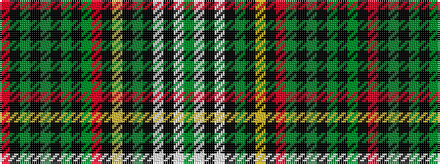

GWKWKGKYKRGKGKGKGKR

It is a 19 stripe tartan.

<figure class="pat-woven">

<figcaption>idealised sample</figcaption>
</figure>

## Colour Sequence



## Tartans with this colour sequence

| Tartans |
|---------------|
| [Douglas, Ancient dress](/variants/s19/r6k6y1k6y1k2y5k1y5r3k2ly3k2y3k8w11k2w4y2~x2/)|
||
