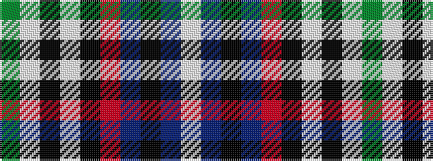

GWKWKRBKBW

It is a 10 stripe tartan.

<figure class="pat-woven">

<figcaption>idealised sample</figcaption>
</figure>

## Colour Sequence



## Tartans with this colour sequence

| Tartans |
|---------------|
| [Victoria State (Australia)](/variants/s10/g24w2k4w2k8r2n51k2t8w1~x2/)|
||
