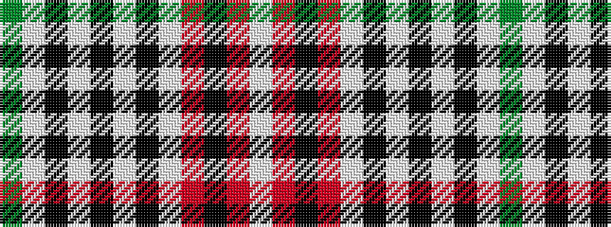

GWKWKWKWRKRW

It is a 12 stripe tartan.

<figure class="pat-woven">

<figcaption>idealised sample</figcaption>
</figure>

## Colour Sequence



## Tartans with this colour sequence

| Tartans |
|---------------|
| [Waverley Check (Corporate)](/variants/s12/y22w2k3w1k1w1k1w7o5k1o2w1~x4/)|
||
