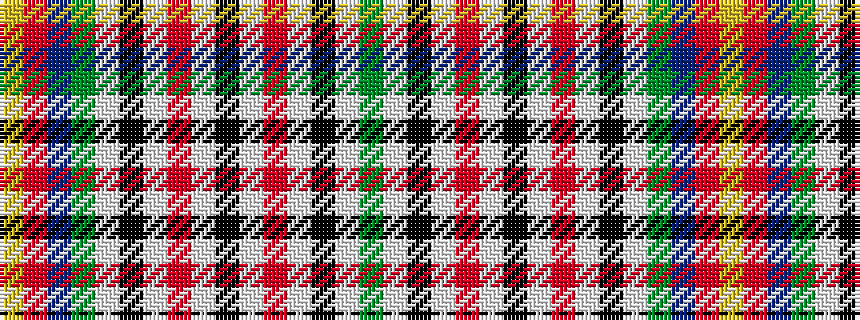

GWKWRWKWRWKWGBRY

It is a 16 stripe tartan.

<figure class="pat-woven">

<figcaption>idealised sample</figcaption>
</figure>

## Colour Sequence



## Tartans with this colour sequence

| Tartans |
|---------------|
| [City Of Dorval](/variants/s16/g4w1k3w1o2w1k3w1o2w1k3w1g3b14r1ly2~x2/)|
||
