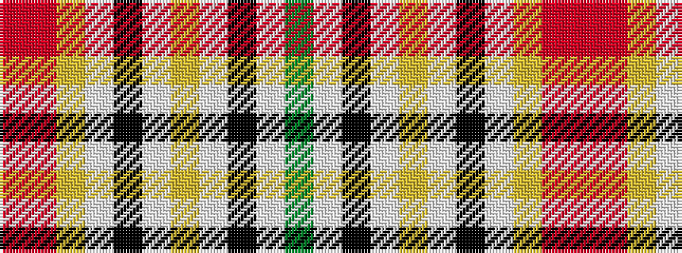

GWKWYWKWYRR

It is a 11 stripe tartan.

<figure class="pat-woven">

<figcaption>idealised sample</figcaption>
</figure>

## Colour Sequence



## Tartans with this colour sequence

| Tartans |
|---------------|
| [Kintyre](/setts/s11/dy1w4k1w9lo2w1k8w1lo2o6r1~x4/)|
||
