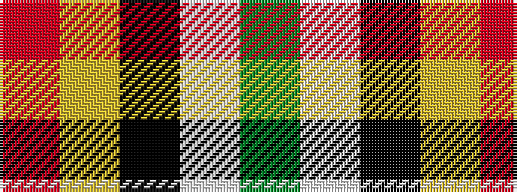

GWKYR

It is a 5 stripe tartan.

<figure class="pat-woven">

<figcaption>idealised sample</figcaption>
</figure>

## Colour Sequence



## Tartans with this colour sequence

| Tartans |
|---------------|
| [Port Moresby City Pipes & Drums](/setts/s5/r2ly36k12w3g2~x2/)|
||
| [Port Moresby City Pipes and Drums](/setts/s5/r2ly33k5w3g2~x2/)|
||
