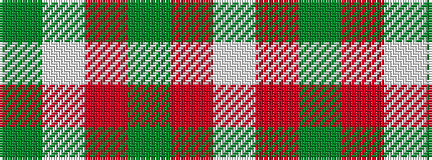

GWRGRW

It is a 6 stripe tartan.

<figure class="pat-woven">

<figcaption>idealised sample</figcaption>
</figure>

## Colour Sequence



## Tartans with this colour sequence

| Tartans |
|---------------|
| [MacDonald of Glenaladale (symmetrical)](/variants/s6/g5w2r27g27r5w2~x2/)|
||
