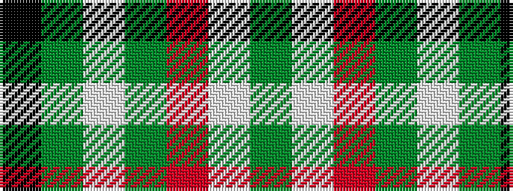

GWRGWGK

It is a 7 stripe tartan.

<figure class="pat-woven">

<figcaption>idealised sample</figcaption>
</figure>

## Colour Sequence



## Tartans with this colour sequence

| Tartans |
|---------------|
| [Michigan State University](/variants/s7/g18w55o19g20w2g20k5/)|
||
