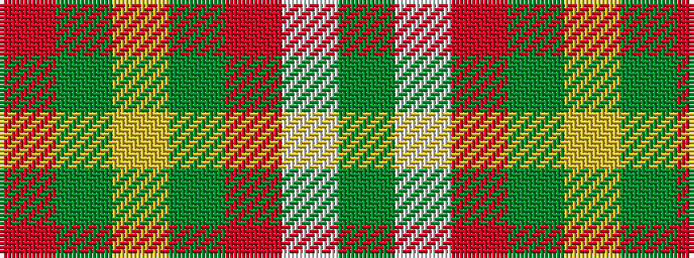

GWRGYGR

It is a 7 stripe tartan.

<figure class="pat-woven">

<figcaption>idealised sample</figcaption>
</figure>

## Colour Sequence



## Tartans with this colour sequence

| Tartans |
|---------------|
| [Tartan for London, A (Fashion)](/variants/s7/r30dg18lr3dg18r20lb3g3~x2/)|
||
