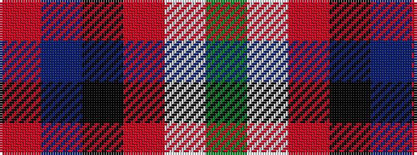

GWRKBR

It is a 6 stripe tartan.

<figure class="pat-woven">

<figcaption>idealised sample</figcaption>
</figure>

## Colour Sequence



## Tartans with this colour sequence

| Tartans |
|---------------|
| [Michael (John) (Personal)](/setts/s6/g5w1r5k5db43r1~x2/)|
||
