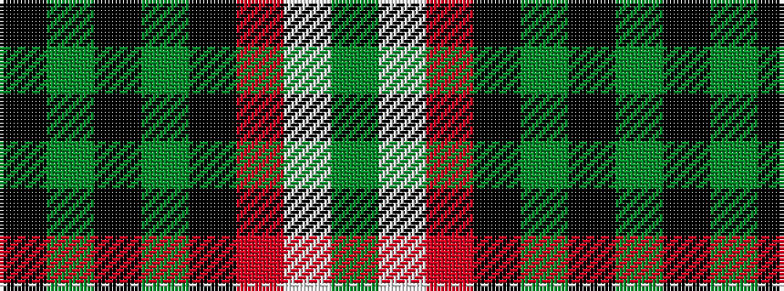

GWRKGKGK

It is a 8 stripe tartan.

<figure class="pat-woven">

<figcaption>idealised sample</figcaption>
</figure>

## Colour Sequence



## Tartans with this colour sequence

| Tartans |
|---------------|
| [BlackRock (Symmetrical)](/setts/s8/k10dg3k6dg20ki8r4w4dg10~x2/)|
||
